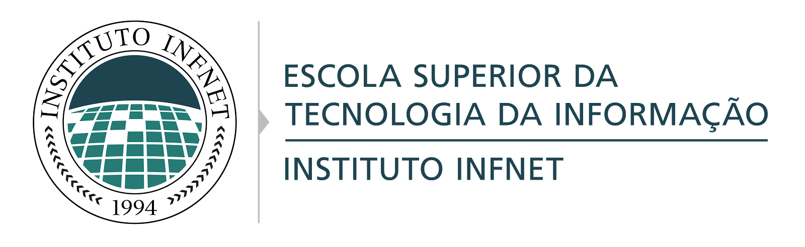

  

<h3 align="center">
   Repository used during the Bachelor of Software Engineering at Infnet [BR] :blue_book:
</h3>

 

## Overview

- **[Getting started](https://unform.dev/)**
- **[Documentation](https://unform.dev/guides/basic-form)**
- **[Why Unform?](https://unform.dev/why-unform)**
- **[FAQ](https://unform.dev/faq)**

Wanna test Unform before using it?

- **[ReactJS playground](https://codesandbox.io/embed/agitated-tdd-uf177?autoresize=1&expanddevtools=1&fontsize=14&hidenavigation=1&theme=dark)**
- **[React Native playground](https://snack.expo.io/@diego3g/1e9fb3)**

*Not available with React Native Web or Expo Web, use the iOS/Android devices in Expo Snack*

## Roadmap

If Unform currently doesn't have a certain feature you think it's awesome, be sure to check out the [roadmap](https://www.notion.so/Unform-public-roadmap-e4dff9e2053c4475b162cd19914eab02) to see if this is already planned for the future. Otherwise, we recommend you create an issue describing your enhancement request.

## Contributing

Thank you for being interested on making this package better. We encourage everyone to help improving this project with some new features, bug fixes and performance issues. Please take a little bit of your time to read our guides, so this process can be faster and easier.

### Contribution Guidelines

Take a moment to read about our [Contribution Guidelines](/.github/CONTRIBUTING.md) so you can understand how to submit an issue, commit and create pull requests.

### Code of Conduct

We expect you to follow our [Code of Conduct](/.github/CODE_OF_CONDUCT.md). You can read it to understand what kind of behaviour will and will not be tolerated.
